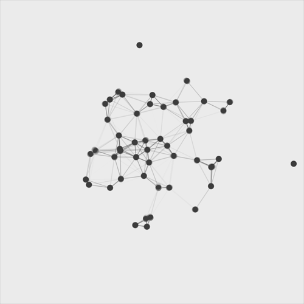

# Europa Framework (v4.0-Core-Validation)

**NeuroCore™**  
© 2026 Davide Luca Nicoletti

---

## Core Concept

  

---

**Europa** is a computational platform designed for the characterization of **complex biological systems** through the extraction of invariant functional signatures. The framework maps stochastic empirical signals $X$ into a feature manifold $\Phi(X)$, enabling the identification of trajectories within the state space $\lambda(t)$.

# Neurodynamical Regime Intelligence 
(IT)
Integrando i motori proprietari NeuroCore™, ASHI Core e HDE, il framework trasforma flussi di dati stocastici (EEG/fNIRS) in traiettorie deterministiche all'interno di un manifold funzionale.

Identificazione dell'ancora omeostatica attraverso l'operatore $L$ ($\phi^* \approx 0.55$).

Predictive Lead Time: Finestra di allerta precoce fino a 18.5 minuti per eventi critici (Epilessia/Parkinson).

Cross-Dataset Validation: 
Architettura normalizzata testata su 793 dataset globali (EU, USA, India, Tanzania).

Edge-Ready Latency: Elaborazione real-time con latenza inferiore a 22ms.

Scientific Focus: Europa formalizza la rottura della simmetria nei sistemi dinamici, offrendo una metrica universale della stabilità neurale indipendente dall'hardware di acquisizione.

---

## Physical Formalism & Core Transformation

The framework operates by transforming raw empirical data into a structured feature representation defined as:

$$X \to \Phi(X)$$

Where:
* **$X$**: Multivariate empirical signals (e.g., EEG, fMRI, biophysical time-series).
* **$\Phi$**: acts as a coarse-graining operator mapping microscopic fluctuations into mesoscopic observables

We model the evolution of the latent state $\lambda(t)$ through an effective stochastic dynamics of the form:

$$
\frac{d\lambda}{dt} = F(\lambda) + \eta(t)
$$

where:
* **$F(\lambda)$** represents the deterministic drift term governing the macroscopic evolution of the system.
* **$\eta(t)$** is a stochastic term accounting for residual fluctuations after coarse-graining, assumed to be a zero-mean process with finite variance.

This representation defines a feature space with inner product structure that encodes the structural fingerprints of latent functional regimes, allowing for the analysis of **system topology** independent of microscopic noise or acquisition bias.

Europa enables a rigorous analysis of system dynamics through:

* **Multi-dataset Invariant Loading:** Seamless ingestion of heterogeneous data while normalizing coupling constants.
* **Pipeline-Agnostic Metrics:** Computation of universal quantitative descriptors independent of systematic preprocessing fluctuations.
* **Stochastic Regime Tracking:** Monitoring of the time-dependent state variable $\lambda(t)$, representing the system’s trajectory between different functional attractors.
* **Cross-System Comparative Analysis:** Visualization and comparison of dynamical manifolds across different populations or experimental conditions.
* **Automated Analytical Reporting:** Generation of synthesis reports (PDF/HTML) effective thermodynamic analogies.

---

## Adaptive Signature Model

At the heart of the framework lies a dynamic weighting system based on the aggregation of universal metrics, aimed at identifying the **functional identity** of the system:

* **FS (Functional Stability):** Analysis of residence time within local energy minima.
* **DV (Dynamic Variability):** Quantification of fluctuations around the expected value (state variance).
* **FR (Functional Resilience):** The system's ability to return to its original attractor following a perturbation.
* **MI (Metric Integration):** The degree of coupling and mutual information between system variables.

The adaptive engine optimizes metric weights to maximize **temporal convergence** and **cross-dataset invariance**, revealing underlying scaling laws.

---

## Computational Ontology

Europa formalizes the study of complex systems based on four pillars:

1.  **Latent Functional Regime ($\lambda(t)$):** A time-dependent representation of system state dynamics.
2.  **Universal Metrics:** Pipeline-independent quantitative descriptors (physical observables).
3.  **Adaptive Signature:** A weighted aggregation representing the functional identity (order parameter).
4.  **System Abstraction:** A standardized interface ensuring reproducibility and cross-domain mathematical formalism.

---

## Latest Release: v4.0-Core-Validation

* **State Trajectory Optimization:** Improved convergence algorithms for $\lambda(t)$ tracking.
* **Information Theory Refactoring:** Enhanced weighting engine for improved **transfer entropy** management.
* **Manifold Visualization:** New tools for high-dimensional state projection and phase-space plotting.

---

> **Scientific Note:** Europa is built for researchers who need to transform noisy biological time-series into interpretable, mathematically sound dynamical models.
